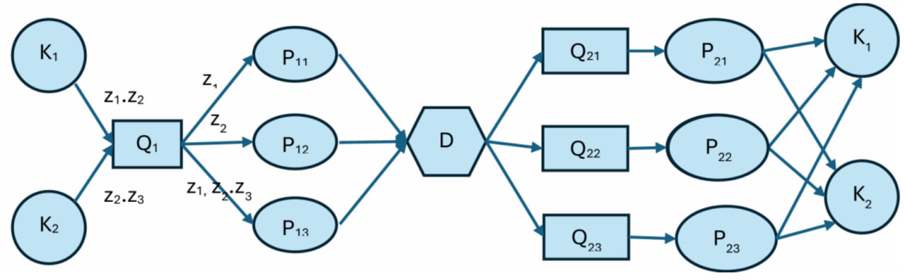

# Queuing Theory Imitation Model

This project implements a distributed queuing system simulation for the DSA (Distributed Systems Architecture) course. The system simulates a multi-stage request processing pipeline with:

- **Priority-based FIFO queuing** (z3 > z2 > z1)
- **Round-robin load balancing** across processors
- **Dynamic processor scaling** (both scale-up and scale-down)
- **Processor fault tolerance** with configurable failure rates
- **Multiple service time distributions** (fixed, uniform, exponential, normal)
- **TCP-based network communication** between nodes

## Architecture



The system implements a multi-stage queuing network:

**Request Flow:** Clients (K₁, K₂) → Priority Queue (Q₁) → First-stage Processors (P₁ₓ) → Distributor (D) → Second-stage Queues (Q₂ₓ) → Second-stage Processors (P₂ₓ) → back to Clients

- **K₁, K₂**: Same client units shown on both left and right sides (represent input and output)
- **Q₁**: Priority queue with **z3 > z2 > z1** ordering, distributes requests **cyclically** using round-robin
- **P₁ₓ**: Type-specific processors (P₁₁ for z1, P₁₂ for z2, P₁₃ for z3)
- **D**: High-performance distribution device that **broadcasts** each request to all three Q₂ₓ queues
- **P₂ₓ**: Final processors that **may fail** - clients must receive responses from **all three** within timeout
- **Success criteria**: Request succeeds only if all sent requests return (e.g., send z1+z2, must receive both back)
- **Dynamic scaling**: When average queue wait time for a request type increases beyond threshold, additional processors are spawned (e.g., high z3 wait time triggers new P₁₃ units). When load decreases, excess processors are removed.

## Project Structure

```
DSA_lab2/
├── README.md
├── config.py                    # All configuration parameters
│
├── common/
│   ├── __init__.py
│   ├── message.py              # Request/Response message classes
│   ├── protocol.py             # Serialization/deserialization
│   ├── distributions.py        # Service time distributions
│   └── logger.py               # Centralized logging
│
├── nodes/
│   ├── __init__.py
│   ├── base_node.py            # Abstract base class for all nodes
│   ├── client.py               # Client (K) implementation
│   ├── queue_node.py           # Queue (Q) implementation
│   ├── processor.py            # Processor (P) implementation
│   └── distributor.py          # Distributor (D) implementation
│
├── core/
│   ├── __init__.py
│   ├── priority_queue.py       # Priority queue data structure
│   ├── round_robin.py          # Round-robin load balancer
│   ├── scaling_monitor.py      # Dynamic scaling logic
│   └── metrics.py              # Performance metrics collection
│
├── network/
│   ├── __init__.py
│   ├── tcp_server.py           # TCP server implementation
│   └── tcp_client.py           # TCP client implementation
│
├── simulation/
│   ├── __init__.py
│   └── simulation_engine.py    # Main simulation orchestrator
│
└── main.py                      # Entry point
```

## Requirements

- Python 3.8 or higher
- No external dependencies (uses standard library only)

## Installation

No installation needed. Simply clone or download the project:

```bash
cd disya_lab2
```

## Running the Simulation

### Basic Usage
```bash
python main.py
```

### With Custom Parameters
```bash
python main.py --duration 60 --rate 2.0 --seed 325
```

### Command-Line Arguments
- `--duration`: Simulation duration in seconds (default: 60.0)
- `--rate`: Request generation rate per client per second (default: 2.0)
- `--seed`: Random seed for reproducibility (default: 325)

### Example Output
```
2025-11-30 12:47:55,544 - main - INFO - Total requests: 32
2025-11-30 12:47:55,548 - main - INFO - Successful: 15 (46.9%)
2025-11-30 12:47:55,548 - main - INFO - Average latency: 3.72s
2025-11-30 12:47:55,548 - main - INFO - Throughput: 1.32 req/s
```

Results are saved to `simulation_results.json`.

## Configuration

All system parameters are in `config.py`. Key settings:

### Queue Configuration
```python
queue_discipline = FIFO              # Queue discipline (FIFO only)
priority_enabled = True              # Enable priority ordering
removal_mode = AFTER_SERVICE         # When to remove from queue
```

### Service Time Distribution
```python
service_time_type = UNIFORM          # FIXED | UNIFORM | EXPONENTIAL | NORMAL
service_time_uniform_a = 0.5         # Uniform distribution lower bound
service_time_uniform_b = 2.0         # Uniform distribution upper bound
```

### Dynamic Scaling
```python
avg_wait_time_threshold = 5.0        # Scale up when avg wait > threshold
scale_down_threshold = 1.5           # Scale down when avg wait < threshold
scaling_cooldown = 10.0              # Seconds between scaling events
max_processors_per_type = 5          # Maximum processors per type
min_processors_per_type = 1          # Minimum processors per type
```

### Fault Tolerance
```python
p2x_failure_probability = 0.025      # P2x processor failure rate
idle_timeout = 60.0                  # Idle timeout before failure
client_request_timeout = 15.0        # Client request timeout
max_retries = 2                      # Maximum retry attempts
```

### Network
```python
tcp_port_base = 5000                 # Starting port for TCP servers
buffer_size = 4096                   # TCP buffer size
```

## System Components

### Stage 1: Clients (K₁, K₂)
- **K₁**: Generates z1 and z2 requests
- **K₂**: Generates z2 and z3 requests
- Configurable request generation rate
- Tracks success/failure/retry statistics
- Waits for responses from all 3 P₂ₓ processors
- Implements timeout and retry logic

### Stage 2: Priority Queue (Q₁)
- **Priority ordering**: z3 > z2 > z1 (z3 has highest priority)
- **FIFO within priority**: Requests of same priority served in order
- **Round-robin dispatch**: Distributes to P₁ₓ processors cyclically
- Collects wait time metrics for scaling decisions
- Thread-safe implementation with locks

### Stage 3: First-Stage Processors (P₁₁, P₁₂, P₁₃)
- **P₁₁**: Processes z1 requests only
- **P₁₂**: Processes z2 requests only
- **P₁₃**: Processes z3 requests only
- Service time based on configured distribution
- Forwards processed requests to Distributor
- **Dynamic scaling**: Additional processors added/removed based on load

### Stage 4: Distributor (D)
- Receives requests from P₁ₓ processors
- **Broadcasts** each request to all three Q₂ₓ queues
- Ensures request reaches all second-stage processors
- No queuing - immediate distribution

### Stage 5: Second-Stage Queues (Q₂₁, Q₂₂, Q₂₃)
- Simple FIFO queues (no priority)
- One queue per P₂ₓ processor
- Forward requests when processor available

### Stage 6: Second-Stage Processors (P₂₁, P₂₂, P₂₃)
- Final processing stage
- **Fault tolerance**: May fail with configured probability
- **Idle timeout**: Fail after prolonged inactivity
- Send responses back to originating clients
- Clients require responses from **all 3 processors** for success

## Key Features

### Dynamic Scaling
The system monitors queue wait times and automatically:
- **Scales up**: Adds processors when `avg_wait > 5.0s`
- **Scales down**: Removes processors when `avg_wait < 1.5s`
- **Cooldown period**: 10 seconds between scaling events
- **Limits**: 1-5 processors per request type

### Service Time Distributions
Four distribution types available:
1. **FIXED**: Constant service time
2. **UNIFORM**: Random between [a, b]
3. **EXPONENTIAL**: Exponential distribution with λ
4. **NORMAL**: Normal distribution (μ, σ) - truncated at 0

### Metrics & Results
Simulation outputs to `simulation_results.json`:
- Total requests sent/completed
- Success/failure rates
- Average latency and throughput
- Per-client statistics
- Per-processor load distribution
- Queue wait times

## Project Structure Details

### `/common` - Shared utilities
- `message.py`: Request/Response data structures
- `protocol.py`: JSON serialization/deserialization
- `distributions.py`: Service time generators
- `logger.py`: Centralized logging setup

### `/nodes` - Node implementations
- `base_node.py`: Abstract base with common functionality
- `client.py`: Client node with request generation
- `queue_node.py`: Queue with priority/round-robin
- `processor.py`: Processor with service time simulation
- `distributor.py`: Broadcasting distributor

### `/core` - Core algorithms
- `priority_queue.py`: Thread-safe priority FIFO queue
- `round_robin.py`: Round-robin load balancer
- `scaling_monitor.py`: Auto-scaling monitor thread
- `metrics.py`: Metrics collection and aggregation

### `/network` - TCP networking
- `tcp_server.py`: Multi-threaded TCP server
- `tcp_client.py`: TCP client with connection pooling

### `/simulation` - Simulation engine
- `simulation_engine.py`: Orchestrates all nodes, manages lifecycle